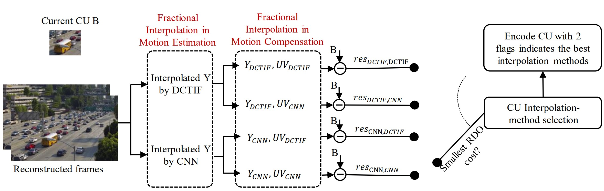
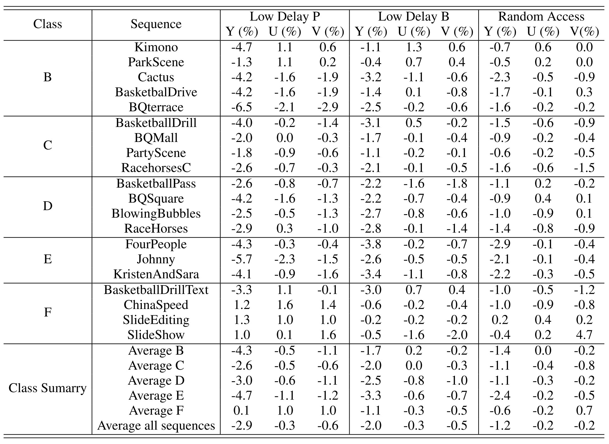
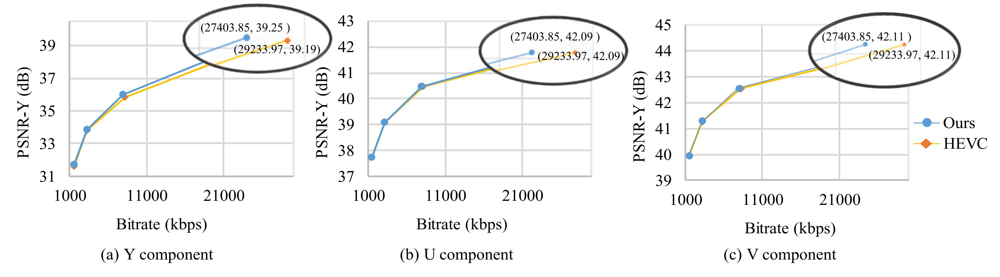
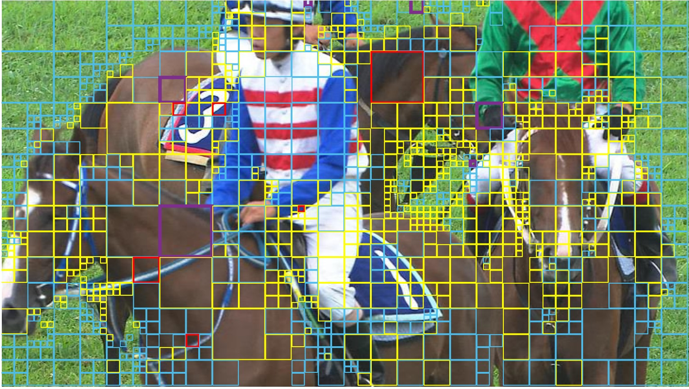

# Deep Learning-Based Luma and Chroma Fractional Interpolation in Video Coding [[paper]](https://ieeexplore.ieee.org/document/8798606)

This repository is PyTorch code for our proposed deep learning based fractional interpolation for video coding.

The code is developed by [AcidHimKoPhim](https://github.com/AcidHimKoPhim) based on [HEVC video coding standard](https://vcgit.hhi.fraunhofer.de/jvet/HM/-/tree/HM-16.20) and [VDSR](https://github.com/twtygqyy/pytorch-vdsr) tested on Ubuntu 16.04/18.04 environment (Python 2.7, PyTorch 0.4.0/1.0.0/1.0.1, CUDA 8.0/9.1) with Tesla V100 GPUs.



In Motion Search, the Y component of the reference frame is interpolated by DCTIF and CNN. In Motion compensation, U and V components of the reconstructed frame are interpolated by both CNN and DCTIF, and the Y component is interpolated by the method in motion search. The residual between current CU B and predicted CU are calculated and encoded with 2 bits indicate interpolation methods for Luma and Chroma components. Finally, an RDO-based fractional interpolation selection is implemented to decide which interpolation method should be used for Luma and Chroma fractional interpolation.

If you find our work useful in your research or publications, please consider citing:

```latex
@ARTICLE{8798606,
  author={Pham, Chi Do-Kim and Zhou, Jinjia},
  journal={IEEE Access}, 
  title={Deep Learning-Based Luma and Chroma Fractional Interpolation in Video Coding}, 
  year={2019},
  volume={7},
  number={},
  pages={112535-112543},
  doi={10.1109/ACCESS.2019.2935378}
  }
```

## Contents
1. [Requirements](#Requirements)
2. [Results](#results)
3. [Acknowledgements](#acknowledgements)

## Requirements
- Python 2 (Anaconda is recommended)
- Pytorch (Pytorch version >=0.4.1 is recommended)
- cv2 (pip install opencv-python)
- Matlab 


#### Quick start

1. Clone this repository:

   ```shell
   git clone https://github.com/AcidHimKoPhim/DLforFractInterpVideoCoding.git
   ```

2. Make HM project:

   ```shell
    mkdir build
    cd build
    cmake .. -DCMAKE_BUILD_TYPE=Release
    make -j
   ```
   
3. Run encoding:

  ```shell
  ./TAppEncoder -c ./cfg/<coding configuration>.cfg -c ./cfg/per-sequence/<specific sequence>.cfg -sn <name of sequence> 
  ```
  
- sn: name of the sequence to be encoded

## Results

#### Quantitative Results



BD-rate (%) of our proposal compared to HEVC under Low Delay P, Low Delay B and Random Access configurations.




R-D curves of sequence BQTerrace under Low Delay P configuration on (a) Y component, (b) U component and (c) U component.



Visualization of our CU selection on RaceHorseC. In this figure, cyan, magenta, yellow, and red blocks indicate CUs that choose DCTIF for YUV interpolation, DCTIF for Y and CNN for UV interpolation, CNN for Y and DCTIF for UV interpolation, and CNN for YUV interpolation, respectively. The rest parts are CUs that choose inter coding with integer motion vector or intra coding.


## Acknowledgements
- Testing videos are standard sequences. Video compression are based on [HM 16.20](https://vcgit.hhi.fraunhofer.de/jvet/HM/-/tree/HM-16.20) jointly developed by the ITU-T Video Coding Experts Group (VCEG, Question 6 of ITU-T Study Group 16) and the ISO/IEC Moving Picture Experts Group (MPEG, Working Group 11 of Subcommittee 29 of ISO/IEC Joint Technical Committee 1).
- We would like to thank [Jiu XU](https://github.com/twtygqyy) for his PyTorch implementation of [VDSR](https://github.com/twtygqyy/pytorch-vdsr).
